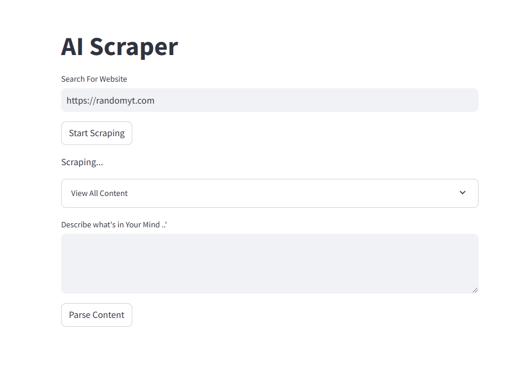

# Web Scraping Using AI

## Collecting and Analyzing Dark Web Data with Python and Llama

---

### Screenshot


---

### Libraries Used:
- **Streamlit**: Allows for quick creation of interactive web apps.
- **LangChain**: Offers a framework for building workflows with language models for tasks like Q&A and summarization.
- **LangChain_Ollama**: Enables integration with Ollama models.
- **Selenium**: Automates browser actions for testing and scraping dynamic pages.
- **BeautifulSoup4**: Parses data from HTML and XML.

---

### How to Use:
1. Enter the link to scrape.
2. Press **Start Scraping**.
3. View all content collected.
4. Enter specific information to focus on.
5. Press **Parse Content**.

---

### Installation Guide:

1. Python Virtual Environment
```bash
python -m venv <venv_name>

---

2. Activate Virtual Environment
```bash
<venv_name>\Scripts\activate

---

3. Install Requirements
```bash
pip install -r requirements.txt

---

4. Install Ollama
To use the Llama model, install it from the official Ollama website.

---

5. Run the Application
```bash
streamlit run main.py --server.port 3001

---

### Reference:
Dark Web Scraping Using AI: Tools, Techniques, and Challenges